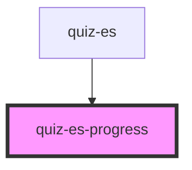

# quiz-es-progress

<!-- Auto Generated Below -->

## Properties

| Property     | Attribute     | Description | Type      | Default     |
| ------------ | ------------- | ----------- | --------- | ----------- |
| `countEdges` | `count-edges` |             | `boolean` | `false`     |
| `step`       | `step`        |             | `number`  | `undefined` |
| `steps`      | `steps`       |             | `number`  | `undefined` |

## Dependencies

### Used by

 - [quiz-es](../quiz-es)

### Graph

----------------------------------------------

*Built with [StencilJS](https://stenciljs.com/)*
