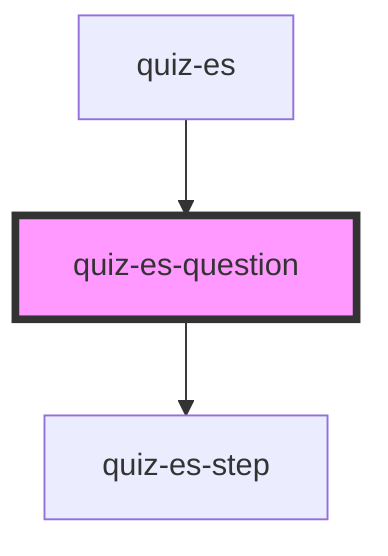

# quiz-es-question

<!-- Auto Generated Below -->

## Properties

| Property      | Attribute      | Description | Type       | Default     |
| ------------- | -------------- | ----------- | ---------- | ----------- |
| `choices`     | --             |             | `string[]` | `undefined` |
| `currentStep` | `current-step` |             | `number`   | `undefined` |
| `nextText`    | `next-text`    |             | `string`   | `'Next'`    |
| `question`    | `question`     |             | `string`   | `undefined` |
| `step`        | `step`         |             | `number`   | `undefined` |

## Events

| Event               | Description | Type               |
| ------------------- | ----------- | ------------------ |
| `questionCompleted` |             | `CustomEvent<any>` |

## Dependencies

### Used by

 - [quiz-es](../quiz-es)

### Depends on

- [quiz-es-step](../quiz-es-step)

### Graph

----------------------------------------------

*Built with [StencilJS](https://stenciljs.com/)*
