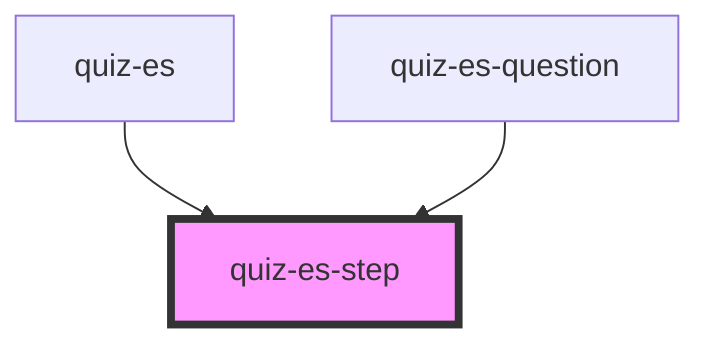

# quiz-es-step

<!-- Auto Generated Below -->

## Properties

| Property      | Attribute      | Description | Type     | Default     |
| ------------- | -------------- | ----------- | -------- | ----------- |
| `currentStep` | `current-step` |             | `number` | `undefined` |
| `step`        | `step`         |             | `number` | `undefined` |
| `type`        | `type`         |             | `string` | `undefined` |

## Dependencies

### Used by

 - [quiz-es](../quiz-es)
 - [quiz-es-question](../quiz-es-question)

### Graph

----------------------------------------------

*Built with [StencilJS](https://stenciljs.com/)*
