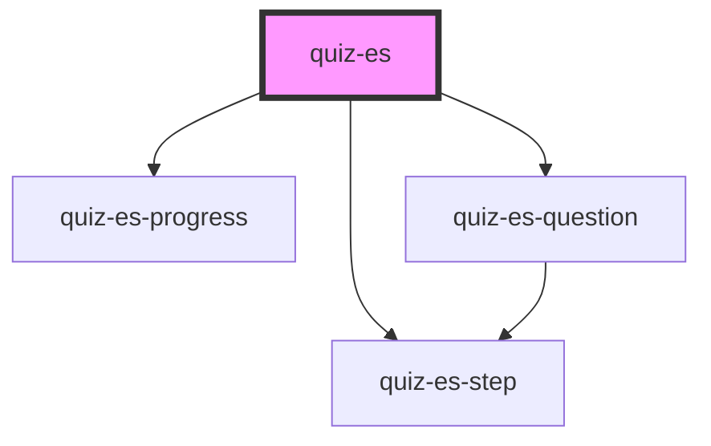

# quiz-es

<!-- Auto Generated Below -->

## Properties

| Property       | Attribute       | Description | Type      | Default        |
| -------------- | --------------- | ----------- | --------- | -------------- |
| `countEdges`   | `count-edges`   |             | `boolean` | `false`        |
| `nextText`     | `next-text`     |             | `string`  | `'Next'`       |
| `questionsKey` | `questions-key` |             | `string`  | `'questions'`  |
| `startText`    | `start-text`    |             | `string`  | `'Start quiz'` |

## Events

| Event           | Description | Type               |
| --------------- | ----------- | ------------------ |
| `quizCompleted` |             | `CustomEvent<any>` |

## Dependencies

### Depends on

- [quiz-es-progress](../quiz-es-progress)
- [quiz-es-step](../quiz-es-step)
- [quiz-es-question](../quiz-es-question)

### Graph

----------------------------------------------

*Built with [StencilJS](https://stenciljs.com/)*
